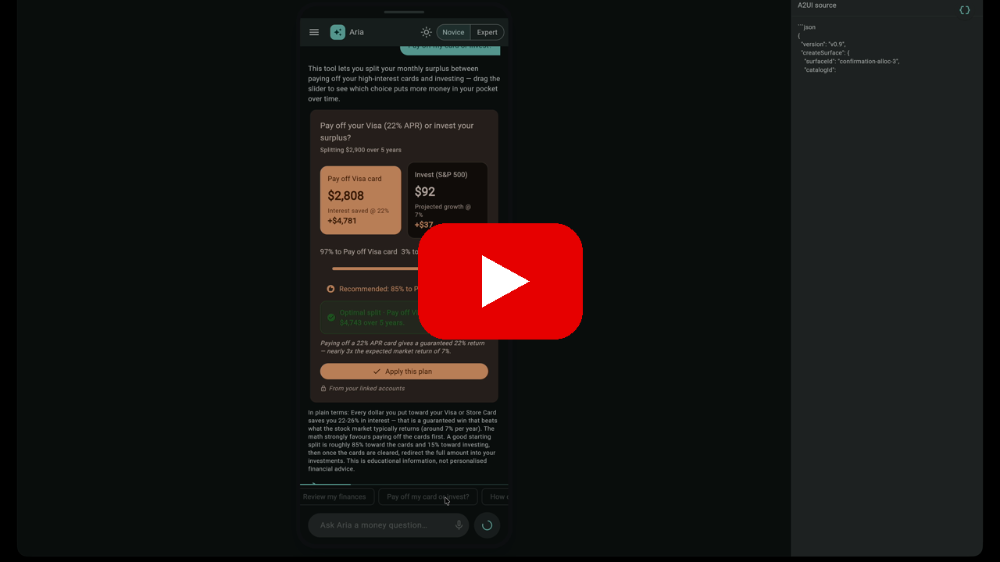
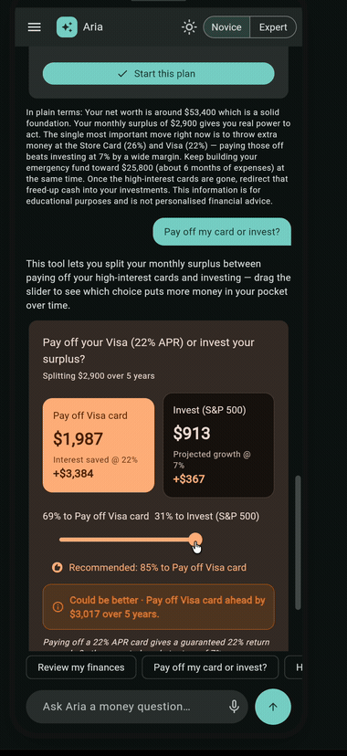

# Aria · Decision Studio

**A generative-UI financial copilot.** Ask any money question and Aria builds an
**interactive tool** to answer it — pre-filled with your real data, computing
live — instead of replying with a wall of text.

> Flutter SF **GenUI Hackathon 2026** · Track: **Financial Services** · Built on
> the [`genui`](https://pub.dev/packages/genui) SDK (A2UI) + Flutter.

<p align="center">
  <a href="https://youtu.be/5k5wT5Fba7E">
    
  </a>
</p>

<p align="center">
  <a href="https://youtu.be/5k5wT5Fba7E"><b>▶ Watch the full demo on YouTube</b></a>
</p>

<p align="center">
  
  <br/>
  <em>Live: Aria builds a debt-vs-invest tool, recomputes as you drag, and confirms when you apply.</em>
</p>

---

## The problem (and why only GenUI solves it)

People face an endless stream of *different* money decisions — pay off debt or
invest? can I afford this? rent or buy? am I saving enough to retire? Two common
approaches both fall short:

- **A normal app** hardcodes a fixed screen per feature. It can never cover every
  decision, and most questions don't match a pre-built screen.
- **An AI chatbot** answers with paragraphs you can't *do* anything with — you
  can't drag a number and see the trade-off change.

**Generative UI is the only fit:** the AI assembles the *right interactive
instrument* for each question at runtime. But to ship that in a real, regulated
product (a bank app), you need guardrails a raw chat artifact can't give:

| | LLM chat artifact | Aria (GenUI) |
|---|---|---|
| Rendering | sandboxed HTML/iframe | **native Flutter widget tree** |
| What the AI can emit | anything (off-brand, unsafe) | only an **approved catalog** |
| The numbers | **hallucinated** by the model | bound to **real data** |
| The math | one-off LLM JS | **deterministic, tested Dart**, offline |
| Model | locked to one vendor | **swappable** (Featherless / Gemini / Claude) |

That separation — **LLM picks intent, your catalog renders it, your data is the
source of truth** — is what makes generative, adaptive UI safe to ship in a real
financial product. That's what we built.

---

## What it does

You ask (type or **speak**) a money question. Aria:

1. **Generates** an interactive instrument from a catalog (a working
   calculator/simulator), pre-filled from your accounts.
2. **Adapts** — picks the right instrument for your intent, varies by **persona**
   (Novice ↔ Expert), and for broad asks ("review my finances") composes a
   **multi-instrument dashboard**.
3. **Acts** — every instrument has an action (e.g. "Apply this plan") that flows
   back to the AI, which confirms with a tailored summary — closing the
   **generate → adapt → act** loop.

Every surface is built from the model's **A2UI** output (viewable live via the
`{}` toggle), proving the UI is genuinely generated, not hardcoded.

---

## The instrument catalogue (15)

| Instrument | Answers | Interaction |
|---|---|---|
| AllocationTradeoff | pay debt vs invest | split slider, debt-first rule |
| SavingsGoalSimulator | reach $X by year Y | contribution slider + progress ring |
| GrowthProjection | what will this grow to | line/area/bar chart + return slider |
| BudgetBreakdown | 50/30/20 budget | donut + needs/wants sliders |
| AmortizationSchedule | loan/mortgage payoff | extra-payment slider, interest saved |
| DebtPayoffPlanner | snowball vs avalanche | strategy toggle + payoff order |
| AffordabilityCheck | can I afford X | financing slider, comfortable/stretch/risky |
| NetWorthTracker | assets vs liabilities | bar + expandable breakdown |
| RetirementProjection | on track to retire | nest egg vs goal, contribution slider |
| EmergencyFundGauge | how long would savings last | runway vs target, top-up slider |
| RentVsBuy | rent or buy a home | years-to-stay slider, break-even year |
| PaycheckBreakdown | where my paycheck goes | take-home / tax / 401k + slider |
| SubscriptionAudit | where money leaks | toggle subs → live savings |
| OptionComparison *(expert)* | compare 2-4 products | tap-to-select matrix |
| RiskAllocation *(expert)* | conservative vs aggressive | risk dial → allocation donut |

Plus a **ConfirmationCard** for the "act" result. Each instrument carries an
AI-chosen colour **tone**, a **value-driven status colour** (shifts good→bad as
you interact), and a **provenance tag** when its numbers come from real data.

---

## Architecture (the "stable layers", each swappable)

- **Intelligence (swappable LLM):** `lib/model/*` — Featherless, Gemini, Claude
  behind one `ModelClient`. The model emits **A2UI intent, never raw UI**.
- **Orchestration:** the `genui` engine + our **Catalog** (`lib/catalog.dart`).
- **Business rules (guardrails):** `lib/domain/business_rules.dart` (debt-first,
  suitability, disclaimers) + an off-catalog graceful fallback.
- **Data + Services (source of truth):** `lib/data/profile_repository.dart` loads
  profile, debts, assets, and market assumptions **live from Supabase** (mock
  fallback). The LLM only *reads* this — it never invents figures.
- **Experience:** native Flutter instruments (`lib/widgets/instruments/*`) +
  fl_chart, in a phone-style shell.

Extras: voice input, light/dark mode, onboarding, sessions menu, live A2UI panel.

---

## Run it (any system)

### 1. Install Flutter
[docs.flutter.dev/install](https://docs.flutter.dev/install), then `flutter doctor`.
Chrome is the only target needed.

### 2. Get the project
```sh
git clone <your-repo-url> aria-decision-studio
cd aria-decision-studio
flutter pub get
```

### 3. Get an API key (any one; Claude recommended)
- **Anthropic** → [console.anthropic.com](https://console.anthropic.com) — `ANTHROPIC_API_KEY`
- **Gemini** → [aistudio.google.com/app/apikey](https://aistudio.google.com/app/apikey) — `GEMINI_API_KEY`
- **Featherless** → [featherless.ai](https://featherless.ai) — `FEATHERLESS_API_KEY`

### 4. Run
Browsers block direct calls to LLM APIs (CORS), so launch Chrome with web
security off for local dev:
```sh
flutter run -d chrome \
  --web-browser-flag "--disable-web-security" \
  --web-browser-flag "--test-type" \
  --dart-define=ANTHROPIC_API_KEY=YOUR_KEY
```
The app auto-selects whichever provider's key you passed; switch live from the
in-app menu. No key set? The app tells you exactly what to do instead of failing.

### 5. (Optional) Live data with Supabase
Without this the app uses a realistic **mock** profile. To load data live:

1. Create a project at [supabase.com](https://supabase.com); copy the **Project
   URL** and **anon/public** key.
2. In the SQL Editor, run:

```sql
create table if not exists profiles (
  id uuid primary key default gen_random_uuid(), first_name text,
  monthly_net_income numeric, monthly_expenses numeric, cash_savings numeric,
  emergency_fund_target numeric, credit_card_balance numeric, credit_card_apr numeric,
  investment_experience text, risk_tolerance text, expected_market_return numeric);
create table if not exists debts (
  id uuid primary key default gen_random_uuid(), name text, balance numeric,
  apr numeric, min_payment numeric);
create table if not exists assets (
  id uuid primary key default gen_random_uuid(), name text, amount numeric);
create table if not exists market (
  id uuid primary key default gen_random_uuid(), sp500_return numeric,
  savings_apy numeric, mortgage_rate numeric, inflation numeric);

alter table profiles enable row level security;
alter table debts enable row level security;
alter table assets enable row level security;
alter table market enable row level security;
drop policy if exists "public read" on profiles; create policy "public read" on profiles for select using (true);
drop policy if exists "public read" on debts;    create policy "public read" on debts    for select using (true);
drop policy if exists "public read" on assets;   create policy "public read" on assets   for select using (true);
drop policy if exists "public read" on market;   create policy "public read" on market   for select using (true);

insert into profiles (first_name, monthly_net_income, monthly_expenses, cash_savings,
  emergency_fund_target, credit_card_balance, credit_card_apr, investment_experience,
  risk_tolerance, expected_market_return)
values ('Affan', 7200, 4300, 18000, 25800, 6400, 22, 'some', 'moderate', 7);
insert into debts (name, balance, apr, min_payment) values
  ('Store card', 1200, 26, 35), ('Visa', 6400, 22, 160), ('Car loan', 9000, 6, 240);
insert into assets (name, amount) values
  ('Cash savings', 18000), ('Investments', 32000), ('Car', 14000);
insert into market (sp500_return, savings_apy, mortgage_rate, inflation)
values (7.0, 4.5, 6.7, 3.0);
```

3. Add the keys to the run command (Supabase is CORS-friendly, no extra flag):
```sh
  --dart-define=SUPABASE_URL=https://YOURPROJECT.supabase.co \
  --dart-define=SUPABASE_ANON_KEY=YOUR_ANON_KEY
```
The header badge shows **Live data** when connected. Edit a row in Supabase and
relaunch — the instruments pre-fill with the new numbers, proving the data is
real, not invented.

---

## Try these

`Review my finances` · `Should I pay off my $10,000 card or invest it?` ·
`How do I pay off my debts?` · `Can I afford a $2,400 laptop?` ·
`Should I rent or buy a $450k home?` · `Am I saving enough for retirement?`

---

## Tech

Flutter · [`genui`](https://pub.dev/packages/genui) (A2UI) ·
`anthropic_sdk_dart` / `googleai_dart` / `openai_dart` · `fl_chart` ·
`speech_to_text` · `http` + Supabase REST.
